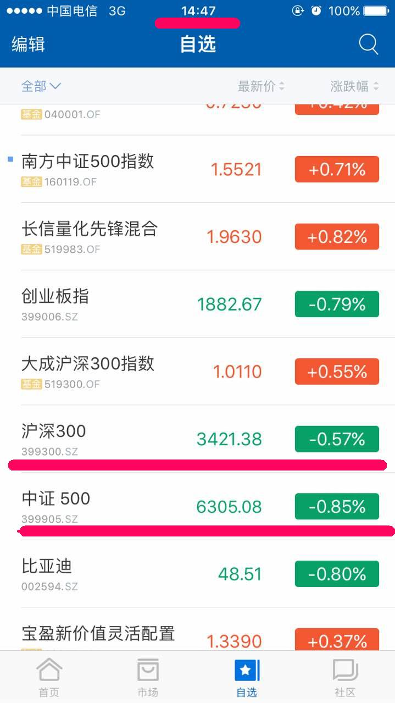
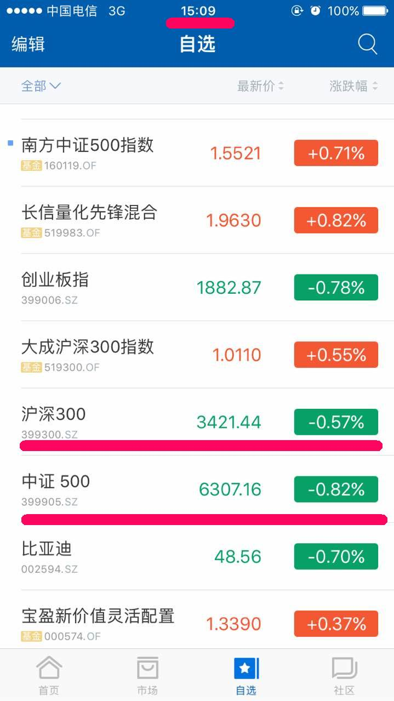
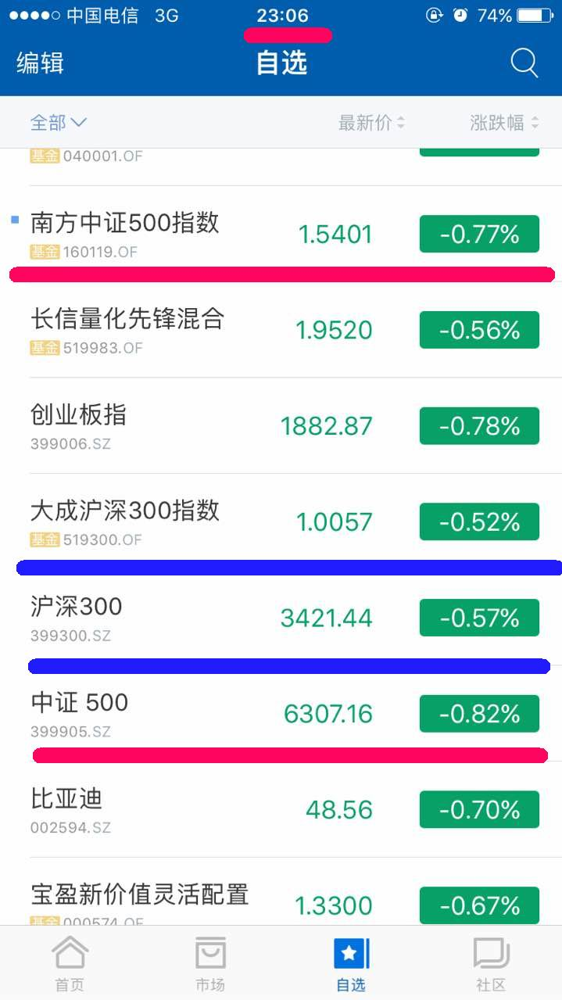
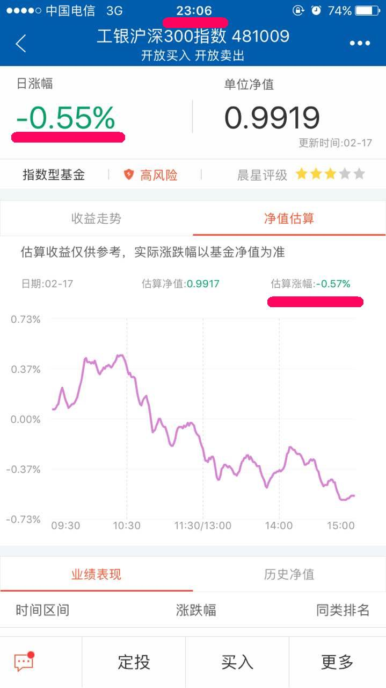
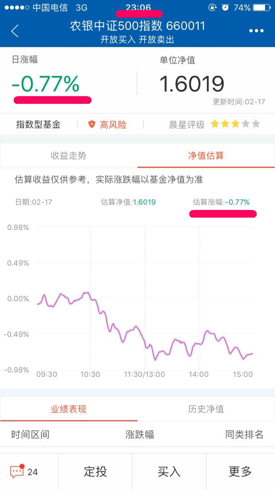
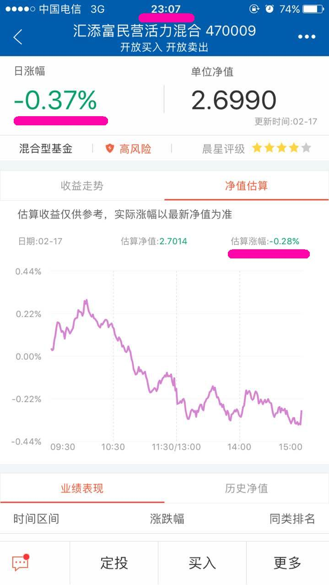

我为什么喜欢指数基金？
自从跟着蓝老师学习基金投资以后，我也开始喜欢上指数基金了，为什么呢？有几个原因。
####1.指数基金的投资门槛低
在蚂蚁聚宝投资指数基金，10元就可以买入指数基金，而且可以选择的基金有很多。
####2.同种属性的指数基金不需要考虑选择哪个
如果我们选择买股票基金、混合基金、债券基金，我们还需要去考虑这些基金历史净值，考虑基金经理的操作情况，甚至做更多的前期准备，才能放心投资这个资金。
而如果选择的是指数基金，就没有这方面的问题。
因为，指数基金是指以上证50指数、沪深300指数、中证500指数、恒生指数等等为指标复制某个指数，对指数内的股票进行投资。
这样，就决定了我们无论是购买大成沪深300指数基金，还是工银沪深300指数基金，它们涨跌幅度不会有太大区别。
因此，当我们决定了购买哪种指数为代表的指数基金时，我们直接就可以选择其中一种指数基金即可，不需要过多的考虑去买什么基金。就是这么直接简单粗暴。
同时，指数基金属于被动型基金，不需要过多的考虑基金经理的操作水平。
所以，选择指数基金是最省心的选择。
####3.跟踪指数，就可以知道当天该指数基金的涨跌情况
再说这个之前，我们可以先看看几张图：

这是在交易日14:47分时的两个指数——沪深300指数和中证500指数的走势。

这是交易日15点过后的两个指数——沪深300和中证500指数的情况。
从这两个截图可以看出，14:45分左右的指数趋势基本可以确定15点时的指数趋势，所以，基本上在14:45分左右我们就可以根据当天的指数趋势确定是否需要购买基金。
从这点来说，比主动型基金好判断了。
关于这点，还有几点可以说明：

这是晚上各基金净值出来以后截的图，从这张图可以看出，中证500指数和南方中证500指数基金、沪深300指数和大成沪深300指数基金的涨幅程度基金一致。

这张图是工银沪深300指数基金净值出来以后的截图，从这张图可以看出来，当天交易时间内估值涨幅是-0.57%，而当日晚上的日涨幅是-0.55%。

这张图是南方中证500指数基金净值出来以后的截图，从这张图可以看出来，当天交易时间内估值涨幅是-0.77%，而当日晚上的日涨幅是-0.77%。

这张图是汇添富民营活力混合基金净值出来以后的截图，从这张图可以看出来，当天交易时间内估值涨幅是-0.28%，而当日晚上的日涨幅是-0.37%。
从这几张图可以看出来，指数基金无论是从相对应的指数涨幅，还是基金的估值涨幅，都是非常接近当天的基金净值。
所以，我们可以非常直观的通过这些指标确定是否购买指数基金，比起那些主动型基金而言，更加清晰。
####4.
